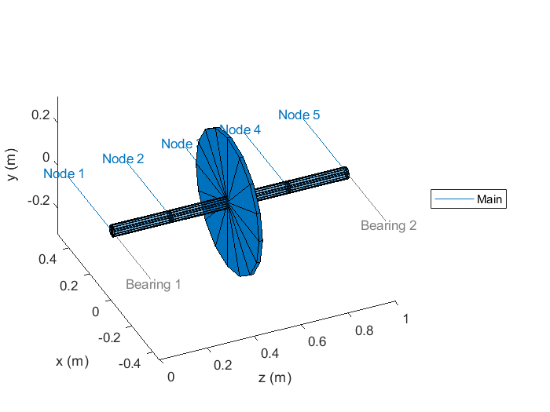
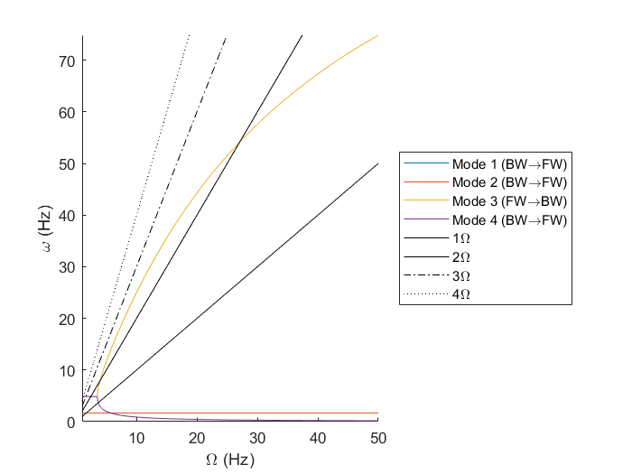
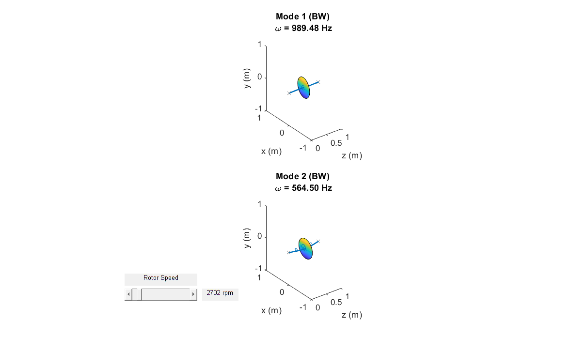
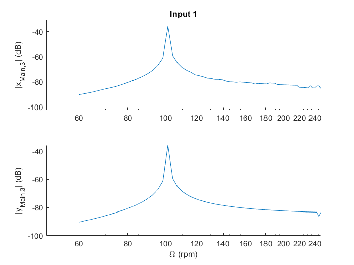

# ROLADYN
MATLAB suite for simulating the lateral dynamics of rotating machines.

## Example rotor-bearing system

Define a rotating machine with a flexible rotor as follows:
``` MATLAB
P.Rotor = {};
P.Bearing = {};
P.Stator = {};

% Rotor
P.Rotor{1}.Name = 'Main';
P.Rotor{1}.Speed = 1;
P.Rotor{1}.Nodes = [0, 0.25, 0.5, 0.75, 1.0]; % Nodes of the FEM

%% Flexible shaft
P.Rotor{1}.Shaft = {};
P.Rotor{1}.Shaft{1}.Name = 'Shaft';
P.Rotor{1}.Shaft{1}.iNodes = 1:5;
P.Rotor{1}.Shaft{1}.Section.ro = 0.0;
P.Rotor{1}.Shaft{1}.Section.ri = 0.025;
P.Rotor{1}.Shaft{1}.Material.Name = 'steel'; 
P.Rotor{1}.Shaft{1}.Material.E   = 210E9;
P.Rotor{1}.Shaft{1}.Material.rho = 7800;

%% Disc
P.Rotor{1}.Disc = {};
P.Rotor{1}.Disc{1}.Name = 'EndCap';
P.Rotor{1}.Disc{1}.iNode = 3;
P.Rotor{1}.Disc{1}.Type = 'Rigid';
P.Rotor{1}.Disc{1}.Options.bGyro = 1;
P.Rotor{1}.Disc{1}.Material.Name = 'steel';
P.Rotor{1}.Disc{1}.Material.E = Inf; %Rigid disc
P.Rotor{1}.Disc{1}.Material.rho = 7800;
P.Rotor{1}.Disc{1}.Ring.Geometry.R = [0 0.3];
P.Rotor{1}.Disc{1}.Ring.Geometry.t = 15E-3;

% Bearings
P.Bearing{1}.Name = 'LeftBearing';
P.Bearing{1}.kyy = 1E3;
P.Bearing{1}.kxx = 1E3;
P.Bearing{1}.cxx = 1E-3;
P.Bearing{1}.cyy = 1E-3;
P.Bearing{1}.Node{1}.Type = 'rotor';
P.Bearing{1}.Node{1}.iNode = 1;
P.Bearing{1}.Node{1}.iRotor = 1;
P.Bearing{1}.z = 0.0;

P.Bearing{2}.Name = 'RightBearing';
P.Bearing{2}.kyy = 1E3;
P.Bearing{2}.kxx = 1E3;
P.Bearing{2}.cxx = 1E-3;
P.Bearing{2}.cyy = 1E-3;
P.Bearing{2}.Node{1}.Type = 'rotor';
P.Bearing{2}.Node{1}.iNode = 5;
P.Bearing{2}.Node{1}.iRotor = 1;
P.Bearing{2}.z = 1.0;

% Excitation 
P.Excite{1}.Name = 'Unbalance';
P.Excite{1}.Type = 'unbalance';
P.Excite{1}.Mode = 'sync';
P.Excite{1}.iRotor = 1;
P.Excite{1}.iDisc =  1;
P.Excite{1}.m     =  0.01;
P.Excite{1}.r     =  0.1;
P.Excite{1}.Angle =  0.0;

P = setupsystem(P);
```

You can visualise the system with:

``` MATLAB
plot_system(P);
```

which will generate a plot of the rototing machine like this:



## Modal analysis
To compute the natural frequencies at a range of speeds:

``` MATLAB
O = linspace(0,50,100)*2*pi; % Speed in rad/s
[V,d,W] = rotor_eig(P.Model,O);
```

where:
- `V` and `W` contain the left and right eigevectors
- `d` contains the eigenvalues

at each speed. 

To convert these eigenvalues and eigenvectors vectors into natural frequencies and mode shapes, run the following:

``` MATLAB
iNode = 2;
[omega,zeta, modes] = eig2modes(V,d,W);

% sort the modes
[~,ii] = sort(omega(:,1));
omega = omega(ii,:);
zeta = zeta(ii,:);
modes = modes(:,ii,:);

kappa = compute_whirl(P,modes,iNode);
```

where:
- `omega` contains the natural frequencies in rad/s
- `zeta` contains the non-dimensionalised damping ratios
- `kappa` contains the whirl direction, defined in terms of the motion at the central disc (node 2).

## Campbell diagram
To plot the Campbell diagram with the first 2 modes, run the following
``` MATLAB
options.xunits = 'Hz';
iPlot = 1:2;
plot_campbell(P,O,omega(iPlot,:),zeta(iPlot,:),kappa(:,iPlot,:),iNode, options); 
```

which will generate a plot of the natural frequencies as a function of rotation speed like this:




## Whirl
To plot the shape of the response at each resonance (ie each mode shape), run the following:
``` MATLAB
plot_whirl(P,O,modes(:,iPlot,:),omega(iPlot,:),kappa(:,iPlot,:));
```


There is a slider which you can use to change which rotation speed the modes are plotted from.


## Synchronous response
Compute the response at all frequencies with:

``` MATLAB
[U,Udot,Uddot] = excitation_frf(P,O);
F = P.Model.Excite.K*U + P.Model.Excite.C*Udot + P.Model.Excite.M*Uddot;
q = rotor_frf_modal(V,d,W,F,O);
```
And then plot the FRF of the disc response (DOF 9 and 10) using:

``` MATLAB
options.xunits = 'Hz';
options.iPlot = 9:10;
plot_frf(P,q,O,options);
```


